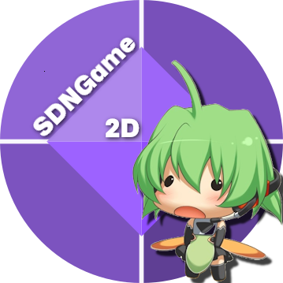

<p align="center">
  
</p>

# SDNGame (Silk.NET)

[](https://www.codefactor.io/repository/github/urq-zink/sdngame)

**SDNGame** is a lightweight and flexible 2D game framework built with C# and powered by **Silk.NET** for OpenGL rendering, input handling, and windowing.

Designed for rapid game prototyping.

## Feature
- **Rendering**: Sprite batches, shape rendering, and font support via OpenGL.
- **Audio**: WAV, MP3, and OGG playback with OpenAL and NAudio integration.
- **Input**: Mouse and keyboard handling via Silk.NET Input.
- **UI System**: Buttons, labels, and message boxes with customizable styles.
- **Physics**: Basic 2D collision detection with various collider shapes (circle, rectangle, polygon, etc.).
- **Scene Management**: Seamless transitions (fade, zoom, rotate) between game scenes.
- **Camera**: 2D camera system with position, rotation, and zoom.
- **Utilities**: Tweening functions, timers, and serialization support.

## Installation
### Prerequisites
- [.NET SDK](https://dotnet.microsoft.com/download) (version 8.0 or later recommended)
- [Git](https://git-scm.com/) for cloning the repository

### Steps
1. Clone the repository:
```bash
git clone https://github.com/yourusername/SDNGame.git
cd SDNGame
```
2. Restore dependences:
```bash
dotnet restore
```
3. Build the project:
```bash
dotnet build
```
4. Run the game:
```bash
dotnet run --project SDNGame/SDNGame.csproj
```
## Usage
### Running the Default Game
The MainGame class initializes with a LoadingScene followed by a MainMenuScene. Press F11 to toggle fullscreen mode.

### Create a Custom Game
1. Extend the Game class:
```csharp
public class MyGame : Game
{
    protected override void Initialize()
    {
        SetScene(new MyCustomScene(this));
    }

    protected override void LoadContent() { }
}
```
2. Define a custom scene by inheriting from Scene:
```csharp
public class MyCustomScene : Scene
{
    public MyCustomScene(Game game) : base(game) { }

    public override void LoadContent()
    {
        // Load assets here
    }

    public override void Update(double deltaTime)
    {
        // Update logic here
    }

    public override void Draw(double deltaTime)
    {
        // Draw logic here
    }
}
```
3. Update Program.cs to use your custom game:
```csharp
using (var game = new MyGame())
{
    game.Run();
}
```
### ExampleScenes
- **DemoScene**: Interactive collider demo with draggable shapes.
- **CircleHuntScene** Mini-game to remove the circles within a time limit.

## Project Structure
```text
SDNGame/
├── Assets/             # Game assets (audio, textures, fonts)
│   ├── Audios/         # Sound files
│   ├── Textures/       # Image files
│   └── Fonts/          # Font files
├── Audio/              # Audio loading and playback
├── Camera/             # 2D camera system
├── Core/               # Core game logic and scenes
│   ├── GameScenes/     # Pre-built scenes (e.g., MainMenu, Loading)
│   └── MainGame.cs     # Default game entry point
├── Input/              # Input handling
├── Physics/            # Collision detection
├── Rendering/          # Rendering components
│   ├── Fonts/          # Font rendering
│   ├── Shapes/         # Shape drawing
│   ├── Sprites/        # Sprite rendering
│   └── Textures/       # Texture management
├── Scenes/             # Scene management and transitions
├── UI/                 # User interface elements
├── Utils/              # Helper classes (e.g., tweening, math)
└── SDNGame.csproj      # Project file
```
## Contributing
### Contributions are welcome! To contribute:
1. Fork the repository
2. Create a feature branch (git checkout -b feature/my-feature).
3. Commit your changes (git commit -m "Add my feature").
4. Push to your branch (git push origin feature/my-feature).
5. Open a pull request

### Please ensure your code follows the existing style and includes appropriate comments

## License
### This project is licensed under the MIT License. See the LICENSE file for details.

## 
Built with ❤️ by [zink-urq]
